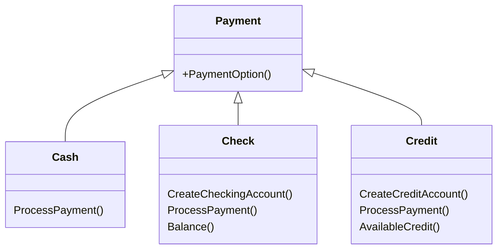

## Object Oriented Programming in golang

> payment package contains all the custom types

```mermaid
classDiagram
    Payment <|-- Cash
    Payment <|-- Check
    Payment <|-- Credit
    Payment : +PaymentOption()
    class Cash {
        ProcessPayment()
    }
    class Check{
        
        CreateCheckingAccount()
        ProcessPayment()
        Balance()
    }

    class Credit {
        CreateCreditAccount()
        ProcessPayment()
        AvailableCredit()
    }

```